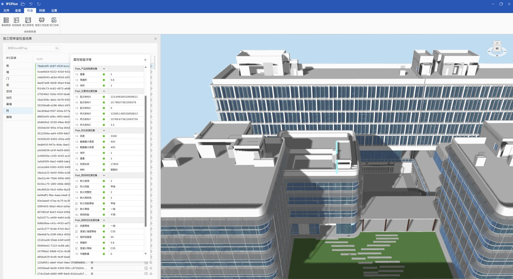

# IFCFlux

**IFCFlux** is a lightweight, pluggable, WebGPU-based IFC engine built for viewing and analyzing IFC files. The app delivers an intuitive UI, high-performance 3D rendering, and rich interaction tools to help AEC professionals inspect and analyze BIM data faster.

**IFCFlux**是一个轻量级，可插拔，基于WebGPU的ifc引擎，专为查看和分析IFC文件设计。本应用提供了直观的用户界面、高性能的3D渲染和丰富的交互功能，帮助建筑工程专业人员更高效地查看和分析BIM模型数据。

## ✨ Features | 功能特性

- **IFC Viewer**: To enable real-time viewing of complex IFC models on ordinary hardware, we introduce a GPU-driven, progressive rendering pipeline. Geometry, semantics, and spatial indexes are decoupled into a three-tier cache, allowing gigabyte-scale models to load in seconds. Rich interaction tools—sectioning, measurement, explode, and property query—are provided out-of-the-box. Every stakeholder can open the model instantly without proprietary design software, eliminating information lag and professional barriers.

  **IFC 查看工具**: 针对复杂IFC模型在普通硬件上的实时查看难题，提出基于GPU-Driven的渐进式渲染管线，将几何、语义与空间索引解耦为三级缓存，实现GB级模型的快速加载，并提供丰富的剖切、测量、爆炸及属性查询等交互体验。让项目各参与方无需专业设计软件即可快捷浏览模型，消除信息滞后与专业壁垒。


- **IFC Checker**: Built on the IFC-MVD standard, the tool parses machine-readable IDS rule-sets and automatically audits every entity in the model for attribute existence, value type, and permissible range. Three quantitative metrics—missing-rate, type-deviation-rate, and out-of-bounds-rate—are reported, giving an objective quality score and a verifiable data set that can later feed machine-learning-based automated drawing-review algorithms.

  **IFC 检查工具**: 基于IFC-MVD标准构建可解析的IDS规则集，对模型中全部构件实体执行属性存在性、值类型及值域的自动遍历验证，输出缺失率、类型偏差率与超限率三项量化指标，为模型质量评估提供量化指标与可验证数据集，并进一步支撑后续机器学习自动审图算法训练。



- **IFC Converter**: Adopting a “model–data separation” strategy, the converter splits IFC entities into geometry and semantics, exporting them as glTF and a relational database respectively while preserving component IDs. The geometry stream feeds the GPU rendering pipeline directly, while the semantic stream supports SQL-level flexible queries. Visualization and data-analytics tasks can now evolve independently, delivering a “convert once, reuse everywhere” extensible data paradigm for the entire project life-cycle.

  **IFC 转换工具**: 采用数模分离策略，将IFC实体按几何与语义解耦，分别导出GLTF与关系数据库，并保持构件ID对应；几何流直接驱动GPU渲染管线，语义流支持SQL级灵活查询，实现可视化与数据分析任务独立迭代，为工程全阶段提供“一次转换、多端复用”的可扩展数据范式。


## 📦 Technology Stack | 技术栈

- **Frontend Framework**: Vue 3

  **前端框架**: Vue 3
  
- **Build Tool**: Vite

  **构建工具**: Vite
  
- **3D Rendering Engine**: Babylon

  **3D渲染引擎**: Babylon
  
- **Type System**: TypeScript

  **类型系统**: TypeScript
  
- **State Management**: Pinia

  **状态管理**: Pinia
  
- **Style Preprocessing**: Less

  **样式预处理**: Less
  
- **Desktop Application Framework**: Tauri

  **桌面应用框架**: Tauri

## ⚡ Highlights | 核心亮点

- **Professional IFC File Viewer**: Supports loading, rendering, and interactively browsing BIM models in IFC format
  
  **专业IFC文件查看**：支持加载、渲染和交互式浏览IFC格式的BIM模型
  
- **High-Performance 3D Rendering**: High-quality 3D visualization engine powered by Babylon.js

  **高性能3D渲染**：基于Babylon.js实现的高质量3D可视化引擎
  
- **Intuitive User Interface**: Ribbon-style interface offering a rich set of operation tools and options

  **直观的用户界面**：采用Ribbon风格界面，提供丰富的操作工具和选项
  
- **Vue 3 + TypeScript**: Leverages a modern frontend stack to ensure code quality and development efficiency

  **Vue 3 + TypeScript**：利用现代前端技术栈确保代码质量和开发效率
  
- **Vite Lightning-Fast Builds**: Enjoy millisecond-level hot module replacement and rapid development experience

  **Vite极速构建**：享受毫秒级的热模块替换和快速的开发体验
  
- **Cross-Platform Support**: Built on the Tauri framework, runs on Windows, macOS, and Linux

  **跨平台支持**：基于Tauri框架，可在Windows、macOS和Linux上运行

## 🚀 Quick Start | 快速开始

### 📋 Prerequisites | 前置要求

- Node.js 22.0.0 or higher

  Node.js 22.0.0 或更高版本
  
- Rust 1.80.0 or higher (optional, for Tauri desktop app builds)

  Rust 1.80.0 或更高版本 (可选，用于Tauri桌面应用构建)
  
- pnpm 8.0.0 or higher

  pnpm 8.0.0 或更高版本

### 📦 Install Dependencies | 安装依赖

```bash
pnpm install
```

### 💻 Development Mode | 开发模式

```bash
# Start frontend dev server
pnpm dev
```
This command starts the Vite dev server, listening on `http://localhost:5000` by default

此命令将启动Vite开发服务器，默认监听 `http://localhost:5000`

```bash
# Start desktop dev mode
pnpm tauri dev
```

This command launches Tauri dev mode, building the frontend assets and starting the desktop application simultaneously

此命令将启动Tauri开发模式，同时构建前端资源并启动桌面应用

### 🚢 Production Build | 生产构建

```bash
// Build frontend assets
pnpm build
```

This command builds optimized frontend assets into the dist directory.

此命令将构建优化后的前端资源到`dist`目录

```bash
// Build desktop application
pnpm tauri build
```

This command packages a platform-specific desktop installer for the current operating system.

此命令将根据当前操作系统构建相应的桌面应用安装包

## 📂 Project Structure | 项目结构
```
IFCFlux/
├── .gitignore              # Git忽略文件配置
├── .npmrc                  # npm配置文件
├── index.html              # 入口HTML文件
├── package.json            # 前端依赖配置
├── pnpm-lock.yaml          # pnpm依赖锁文件
├── README.md               # 项目说明文档
├── tsconfig.json           # TypeScript配置
├── tsconfig.node.json      # Node.js环境的TypeScript配置
├── vite.config.ts          # Vite构建工具配置
├── public/                 # 静态资源目录
│   ├── favicon.png         # 网站图标
│   ├── logo.png            # 应用Logo
│   ├── fonts/              # 字体文件
│   ├── icons/              # SVG图标
├── src/                    # 前端源代码目录
│   ├── App.vue             # 主应用组件
│   ├── main.ts             # 应用入口文件
│   ├── types.ts            # 全局TypeScript类型定义
│   ├── vite-env.d.ts       # Vite环境变量的类型声明
│   ├── components/         # Vue组件
│   ├── composables/        # Vue组合式函数
│   ├── services/           # 应用的核心服务
│   ├── store/              # 状态管理
│   ├── styles/             # 全局样式和变量
│   └── utils/              # 工具函数
└── src-tauri/              # Tauri桌面应用源代码
    ├── .gitignore          # Tauri相关的Git忽略配置
    ├── build.rs            # Rust构建脚本
    ├── Cargo.lock          # Rust依赖锁文件
    ├── Cargo.toml          # Rust项目和依赖配置
    ├── tauri.conf.json     # Tauri应用配置文件
    ├── capabilities/       # Tauri能力和权限配置
    ├── icons/              # 应用图标
    └── src/                # Rust源代码
```

## ⚙️ Configuration | 配置

### 🔧 Vite Configuration | Vite配置

Modify dev-server port, proxy and other build options in `vite.config.ts`.

开发服务器端口、代理和其他构建配置可在 `vite.config.t`s 中修改。

### 🦀 Tauri Configuration | Tauri配置

Window size, icon, permissions and other desktop-app settings are in `src-tauri/tauri.conf.json`.

桌面应用的窗口大小、图标、权限等配置可在 `src-tauri/tauri.conf.json` 中修改。

### 🎛️ Application Configuration | 应用配置

Default settings and theme options are located in `src/utils/config.ts` and `src/utils/default.config.ts`.

应用的默认设置和主题配置可在 `src/utils/config.ts` 和 `src/utils/default.config.ts` 中修改。

## ⚖️ License | 协议

This project is licensed under the Apache License 2.0; see the LICENSE file for details.

本项目采用 Apache License 2.0 许可证，详情见 LICENSE 文件。
